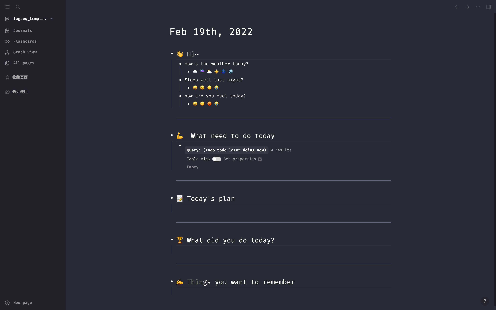
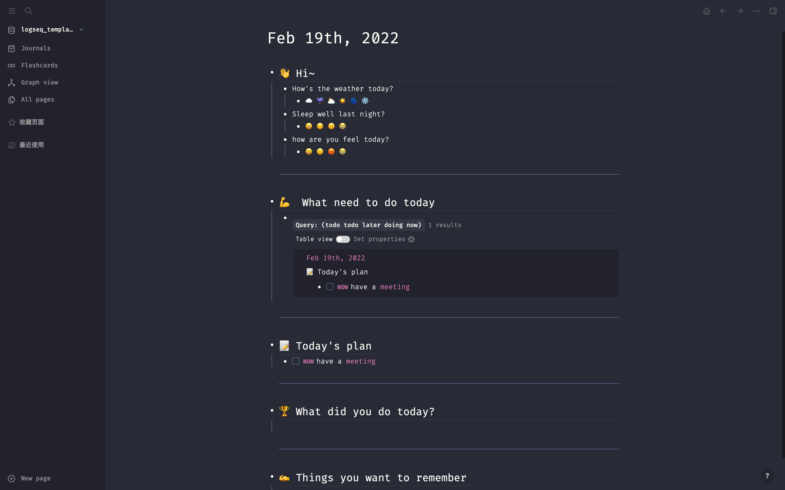
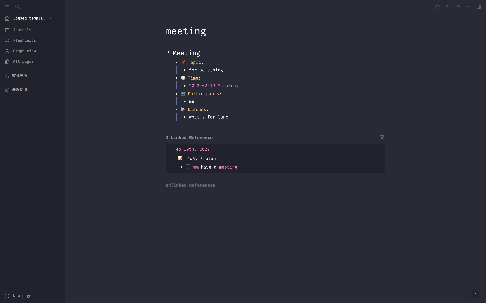

# logseq_template

-   journal 模板
-   meeting 模板
-   [theme dracula](https://github.com/dracula/logseq)

-   每日自动生成 journal 模板


## quick start

-   安装 git

-   安装 logseq

-   clone 项目到本地

    -   ```shell
        git clone https://github.com/ningzio/logseq_template
        ```

-   在 logseq 中添加图谱

-   路径选择 logseq_template/template

-   done

## shorcut







